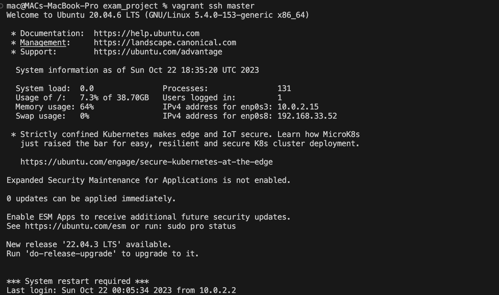

# Cloud Engineering Second Semester Examination Project

## Objective

1.  **Automate the provisioning of two Ubuntu-based servers, named "Master" and "Slave", using Vagrant.**

- Initiate the bash script "master-slave.sh". This will create, configure and spin up both the master and slave vagrant.

  

   

  Master Node Start up

   

  Slave Node Start up

 

2. **On the Master node, create a bash script to automate the deployment of a LAMP (Linux, Apache, MySQL, PHP) stack.
   This script should clone a PHP application from GitHub, install all necessary packages, and configure Apache web server and MySQL.**

- Initiate the bash script "laravel.sh" with two variables which represents the database, username and password for MySql. Kindly, make the bash script executable before doing this. For example; ./laravel.sh "idan_balablu" "bulaba2023". This script contains the Apache, Mysql, Php, ansible installation and cloning of the github repository which can also be reusable by any other user.

  Laravel on Master node

3. **The next task is to execute the bash script on the slave node, verifying the PHP application with it's IP address and creating a cron job to check the server's uptime every 12 am with the use of an ansible playbook.**

- Make sure you have master node ssh public-key in the slave node ssh authorized key so that the master node can have access to the slave node.
   

  

   

  

- Then, i created ansible-playbook which include the ansible config file, inventory file and main.yml that will deploy the bash script "laravel-slave.sh" and also execute the cron job task.

  

     

  

     

  
